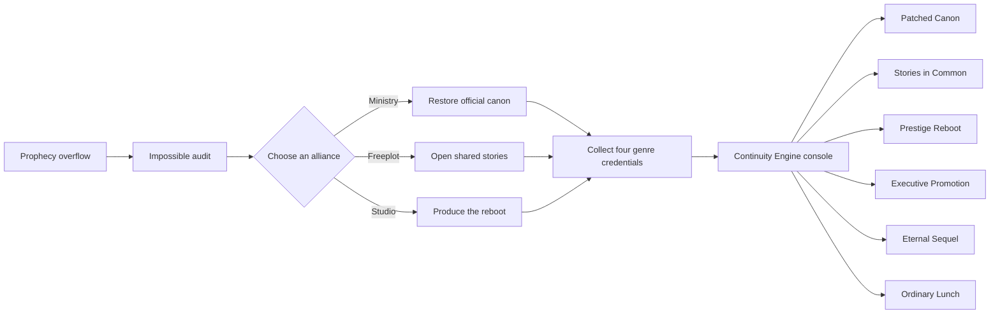

# aux-demworld — Repository Chronicle (main)

The primary Git branch is `repository-chronicle`, displayed as `Repository Chronicle (main)`. It is the AI-authored repository-documentation universe and tells the current state of Everend Forge in first person while remaining a complete WorldNotion and PathBranching demo.

The setting parodies broad genre conventions—space dynasties, wizard schools, collectible creatures, municipal superheroes, chosen-one prophecies, and corporate reboots—without using characters, names, settings, or lore from existing franchises.

## What is included

- A connected canon of characters, locations, organizations, items, creatures, concepts, and historical events.
- A custom Everend taxonomy and reusable entity templates.
- A modular PathBranching v0.2 story named **The Last Acceptable Reboot**.
- Four major route families and six distinct endings.
- A Compendium configuration that publishes canon and proposal material.
- A repository validator and GitHub Actions workflow.

## Application boundaries

| Application   | Example data in this repository                                                                                       |
| ------------- | --------------------------------------------------------------------------------------------------------------------- |
| WorldNotion   | Markdown entities, folder descriptions, `.everend/universe.json`, `.everend/taxonomy.yaml`, and `.everend/templates/` |
| PathBranching | `.everend/.pathbranching/manifest.json` and the modular v0.2 story workspace                                          |
| Compendium    | `.everend/compendium.yaml`, publishable entity statuses, and the read-only narrative projection                       |

## Story map



## Open it in Everend Forge

1. Clone or download this repository.
2. Open the repository root as a universe in WorldNotion or the Forge Suite.
3. Switch to PathBranching to edit **The Last Acceptable Reboot**.
4. Build the public reader with Compendium:

```bash
cd ../everend-compendium
npm run site:build -- ../aux-demworld --out=dist-demo
```

## Validate the vault

```bash
npm install
npm test
```

The validator checks entity identity, taxonomy and Compendium metadata, PathBranching storage structure, canon references, transitions, branches, and the presence of multiple terminal endings.

## Guía rápida en español

Este repositorio es un universo de demostración completo. Abre la carpeta raíz en Forge Suite para navegar el canon en WorldNotion, editar las rutas y finales en PathBranching, y generar una enciclopedia estática con Compendium. Todo el contenido es sintético y puede reutilizarse bajo CC BY 4.0.
